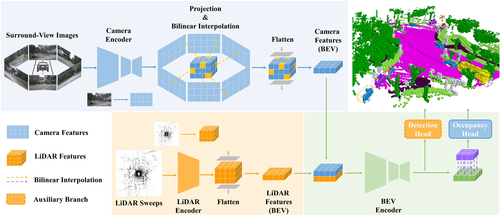

# DAOcc

[](https://paperswithcode.com/sota/prediction-of-occupancy-grid-maps-on-occ3d?p=daocc-3d-object-detection-assisted-multi)

> **DAOcc: 3D Object Detection Assisted Multi-Sensor Fusion for 3D Occupancy Prediction 
> [[`arxiv`](https://arxiv.org/abs/2409.19972)]**
> <br> Zhen Yang, Heng Wang, Yanpeng Dong
> <br> Beijing Mechanical Equipment Institute, Beijing, China

This is the official implementation of DAOcc. DAOcc is a novel multi-modal occupancy prediction framework that leverages 3D object detection to assist in achieving superior performance while using a deployment-friendly image encoder and practical input image resolution.



## News

* **2025-01-31**: Release the model weights and the first version of the code.
* **2024-10-01**: Our preprint is available on [arXiv](https://arxiv.org/abs/2409.19972).

## Experimental results

### 3D Semantic Occupancy Prediction on [Occ3D-nuScenes](https://github.com/Tsinghua-MARS-Lab/Occ3D)

| Method | Camera <br/> Mask | Image <br/> Backbone | Image <br/> Resolution | mIoU  |                          Config                          |     Model      |                                             Log                                              |
|:------:|:-----------------:|:--------------------:|:----------------------:|:-----:|:--------------------------------------------------------:|:--------------:|:--------------------------------------------------------------------------------------------:|
| DAOcc  |         √         |         R50          |        256×704         | 53.82 | [config](configs/nuscenes/occ3d/daocc_occ3d_w_mask.yaml) | [model](https://drive.google.com/file/d/1CDQrv9gQOYnz1sjxhybZKtvwGvTuvIzG/view?usp=sharing) | [log](https://drive.google.com/file/d/1lnEJn1Akr71k1-OYHKKqMbrqk9T6J_qf/view?usp=drive_link) |
| DAOcc* |         √         |         R50          |        256×704         | 54.19 |                            -                             | [model](https://drive.google.com/file/d/1_UvDO5ldL8102TmYIq_rX4yPMz-b9ib_/view?usp=sharing) |                                              -                                               |

| Method | Camera <br/> Mask | Image <br/> Backbone | Image <br/> Resolution | RayIoU |   Config   |     Model      |     Log      |
|:------:|:-----------------:|:--------------------:|:----------------------:|:------:|:----------:|:--------------:|:------------:|
| DAOcc  |         ×         |         R50          |        256×704         |  48.2  | [config](configs/nuscenes/occ3d/daocc_occ3d_wo_mask.yaml) | [model](https://drive.google.com/file/d/12naKlrec09QEF-7mGtAyW07au1WjYeKI/view?usp=sharing) | [log](https://drive.google.com/file/d/1XK3O4RLYxT_33kmVuWGu4Pt9Wj9X72AA/view?usp=sharing) |

- \* means use exponential moving average (EMA) hook.

### 3D Semantic Occupancy Prediction on [SurroundOcc](https://github.com/weiyithu/SurroundOcc)

| Method | Image <br/> Backbone | Image <br/> Resolution | IoU  | mIoU |   Config   |     Model      |     Log      |
|:------:|:--------------------:|:----------------------:|:----:|:----:|:----------:|:--------------:|:------------:|
| DAOcc  |         R50          |        256×704         | 45.0 | 30.5 | [config](configs/nuscenes/surroundocc/daocc_surroundocc.yaml) | [model](https://drive.google.com/file/d/1PCnKEoXJ1Kd2ccFoYUUlKCf_Mnqo7n5f/view?usp=sharing) | [log](https://drive.google.com/file/d/1IPX4MI8WZywpZ4nv333SitE5BuoP7Fmv/view?usp=sharing) |

### 3D Semantic Occupancy Prediction on [OpenOccupancy](https://github.com/JeffWang987/OpenOccupancy)

| Method | Image <br/> Backbone | Image <br/> Resolution | IoU  | mIoU | Config | Model | Log |
|:------:|:--------------------:|:----------------------:|:----:|:----:|:------:|:-----:|:---:|
| DAOcc  |         R18          |        256×704         | 32.2 | 24.1 |   -    |   -   |  -  |

## Getting Started
- [Installation](docs/install.md) 
- [Prepare Dataset](docs/data.md)
- [Train and Eval](docs/run.md)

## Citation

```bibtex
@article{yang2024daocc,
  title={DAOcc: 3D Object Detection Assisted Multi-Sensor Fusion for 3D Occupancy Prediction},
  author={Yang, Zhen and Dong, Yanpeng and Wang, Heng},
  journal={arXiv preprint arXiv:2409.19972},
  year={2024}
}
```

## Acknowledgements

Many thanks to these excellent open-source projects:

- [MMDetection3D](https://github.com/open-mmlab/mmdetection3d)
- [BEVFusion](https://github.com/mit-han-lab/bevfusion)
- [FlashOcc](https://github.com/Yzichen/FlashOCC)