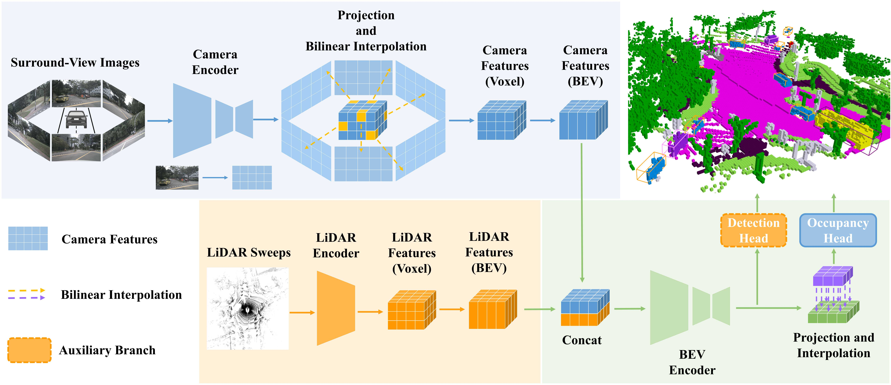

# DAOcc

> **DAOcc: 3D Object Detection Assisted Multi-sensor Fusion for 3D Occupancy Prediction**
> <br> Zhen Yang
> <br> Beijing Mechanical Equipment Institute, Beijing, China

This is the official implementation of DAOcc. DAOcc is a novel multi-modal occupancy prediction framework that leverages 3D object detection to assist in achieving superior performance while using a deployment-friendly image encoder and practical input image resolution.



## News

## Experimental results

### 3D Semantic Occupancy Prediction on [Occ3D-nuScenes](https://github.com/Tsinghua-MARS-Lab/Occ3D)

| Method | Camera <br/> Mask | Image <br/> Backbone | Image <br/> Resolution | mIoU  |   Config    |     Model      |     Log      |
|:------:|:-----------------:|:--------------------:|:----------------------:|:-----:| :---------: |:--------------:|:------------:|
| DAOcc  |         √         |         R50          |        256×704         | 53.82 | [config](x) | [model](x.pth) | [log](x.log) |

| Method | Camera <br/> Mask | Image <br/> Backbone | Image <br/> Resolution | RayIoU |   Config    |     Model      |     Log      |
|:------:|:-----------------:|:--------------------:|:----------------------:|:------:| :---------: |:--------------:|:------------:|
| DAOcc  |         ×         |         R50          |        256×704         |  48.2  | [config](x) | [model](x.pth) | [log](x.log) |

### 3D Semantic Occupancy Prediction on [SurroundOcc](https://github.com/weiyithu/SurroundOcc)

| Method | Image <br/> Backbone | Image <br/> Resolution | IoU  | mIoU |   Config    |     Model      |     Log      |
|:------:|:--------------------:|:----------------------:|:----:|:----:| :---------: |:--------------:|:------------:|
| DAOcc  |         R50          |        256×704         | 45.0 | 30.5 | [config](x) | [model](x.pth) | [log](x.log) |

## Getting Started

## Citation

```bibtex
TBD
```

## Acknowledgements

Many thanks to these excellent open-source projects:

- [MMDetection3D](https://github.com/open-mmlab/mmdetection3d)
- [BEVFusion](https://github.com/mit-han-lab/bevfusion)
- [FlashOcc](https://github.com/Yzichen/FlashOCC)